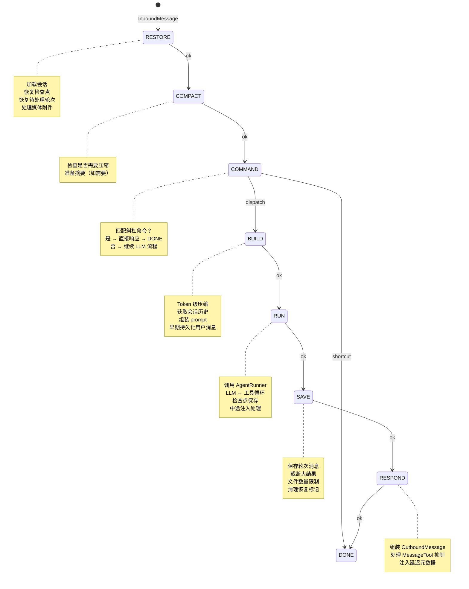

# AgentLoop 用户轮次生命周期详解

本文档详细描述 `AgentLoop`（`nanobot/agent/loop.py`）如何管理一个用户轮次（user turn）的完整生命周期。

## 总览

一条用户消息从进入系统到最终响应，经历以下状态机：

```
RESTORE → COMPACT → COMMAND → BUILD → RUN → SAVE → RESPOND → DONE
```

每个状态由独立的 handler 方法实现（`_state_restore`、`_state_compact` 等），状态之间通过事件驱动的转换表 `_TRANSITIONS` 连接。每个 handler 返回一个事件字符串（如 `"ok"`），转换表根据 `(当前状态, 事件)` 决定下一个状态。

```python
# nanobot/agent/loop.py:167-176
_TRANSITIONS: dict[tuple[TurnState, str], TurnState] = {
    (TurnState.RESTORE, "ok"):        TurnState.COMPACT,
    (TurnState.COMPACT, "ok"):        TurnState.COMMAND,
    (TurnState.COMMAND, "dispatch"):  TurnState.BUILD,
    (TurnState.COMMAND, "shortcut"):  TurnState.DONE,   # 命令直接结束
    (TurnState.BUILD, "ok"):          TurnState.RUN,
    (TurnState.RUN, "ok"):            TurnState.SAVE,
    (TurnState.SAVE, "ok"):           TurnState.RESPOND,
    (TurnState.RESPOND, "ok"):        TurnState.DONE,
}
```

## 入口：消息如何进入状态机

### 1. 消息总线消费

`AgentLoop.run()` 是主循环入口。它从 `MessageBus` 持续消费 `InboundMessage`：

```python
# nanobot/agent/loop.py:842-866
async def run(self) -> None:
    self._running = True
    await self._connect_mcp()
    while self._running:
        msg = await asyncio.wait_for(self.bus.consume_inbound(), timeout=1.0)
        # ... 路由逻辑
```

收到消息后，`run()` 按以下优先级路由：

1. **运行时控制消息**（如 MCP 控制）→ `handle_runtime_control()` 直接处理
2. **优先级命令**（如 `/stop`）→ 立即内联分发，不进入状态机
3. **已有活跃会话的消息** → 路由到 `pending_queue` 进行中途注入（mid-turn injection）
4. **普通消息** → 创建 `asyncio.Task` 调用 `_dispatch()`

### 2. 并发控制：`_dispatch()`

`_dispatch()` 负责并发控制和会话序列化：

```python
# nanobot/agent/loop.py:919-1064
async def _dispatch(self, msg: InboundMessage) -> None:
    lock = self._session_locks.setdefault(session_key, asyncio.Lock())
    gate = self._concurrency_gate or nullcontext()

    async with lock, gate:
        # lock  → 同一会话内串行处理
        # gate  → 跨会话并发上限（默认 3，由 NANOBOT_MAX_CONCURRENT_REQUESTS 控制）
        response = await self._process_message(msg, ...)
```

关键设计：
- **会话锁**（`_session_locks`）：保证同一会话的消息严格串行
- **并发门**（`_concurrency_gate`）：`asyncio.Semaphore`，限制全局并发请求数
- **待处理队列**（`_pending_queues`）：当会话正在处理时，新消息进入队列等待中途注入

### 3. 状态机驱动：`_process_message()`

`_process_message()` 是状态机的驱动器：

```python
# nanobot/agent/loop.py:1183-1279
async def _process_message(self, msg, ...) -> OutboundMessage | None:
    ctx = TurnContext(msg=msg, session_key=key, state=TurnState.RESTORE, ...)

    while ctx.state is not TurnState.DONE:
        handler_name = f"_state_{ctx.state.name.lower()}"
        handler = getattr(self, handler_name)

        t0 = time.perf_counter()
        event = await handler(ctx)          # 执行当前状态的 handler
        duration = (time.perf_counter() - t0) * 1000

        ctx.trace.append(StateTraceEntry(   # 记录追踪信息
            state=ctx.state, duration_ms=duration, event=event,
        ))

        next_state = self._TRANSITIONS.get((ctx.state, event))
        ctx.state = next_state              # 状态转移

    return ctx.outbound
```

每个状态的执行时间和事件都被记录到 `ctx.trace` 中，用于性能追踪和调试。

## 状态详解

### RESTORE：恢复阶段

**职责**：加载会话、恢复中断状态、处理媒体附件。

```python
# nanobot/agent/loop.py:1314-1338
async def _state_restore(self, ctx: TurnContext) -> str:
```

具体步骤：

1. **媒体预处理**：如果消息包含媒体（图片、文档），调用 `_prepare_message_media()` 处理。文档类附件会提取文本内容，图片会保留为多模态内容。

2. **获取/创建会话**：通过 `SessionManager.get_or_create()` 获取或创建 `Session` 对象。

3. **发布轮次开始事件**：通知运行时事件总线，WebUI 等监听者可以更新 UI 状态。

4. **持久化工作区范围**：记录消息关联的工作区路径，用于后续工具的安全边界检查。

5. **恢复运行时检查点**（`_restore_runtime_checkpoint`）：如果上一次轮次在工具执行中途崩溃，这里会将已完成的助手消息和工具结果恢复到会话历史中，未完成的工具调用标记为中断错误。

6. **恢复待处理用户轮次**（`_restore_pending_user_turn`）：如果上一次轮次只持久化了用户消息就崩溃了，这里会补充一条错误回复，保持会话历史的完整性。

**为什么恢复放在最前面**：在构建新上下文之前，必须先确保会话历史是完整的。否则中断的工作会丢失，模型看到的历史也会不一致。

### COMPACT：压缩阶段

**职责**：检查是否需要压缩会话历史以适应上下文窗口。

```python
# nanobot/agent/loop.py:1350-1353
async def _state_compact(self, ctx: TurnContext) -> str:
    ctx.session, pending = self.auto_compact.prepare_session(ctx.session, ctx.session_key)
    ctx.pending_summary = pending
    return "ok"
```

`AutoCompact.prepare_session()` 检查会话是否满足压缩条件（如 TTL 过期、token 超限）。如果需要压缩，返回一个 `pending` 摘要，该摘要会在后续 BUILD 阶段作为 `session_summary` 传入上下文构建。

压缩是异步的——实际的 token 级压缩由 `Consolidator` 在后台执行，这里只是触发和检查。

### COMMAND：命令路由阶段

**职责**：检测并处理斜杠命令（如 `/new`、`/model`、`/stop`）。

```python
# nanobot/agent/loop.py:1355-1378
async def _state_command(self, ctx: TurnContext) -> str:
    raw = ctx.msg.content.strip()
    cmd_ctx = CommandContext(msg=ctx.msg, session=ctx.session, ...)
    result = await self.commands.dispatch(cmd_ctx)

    if result is not None:
        ctx.outbound = result
        # 命令结果直接持久化，跳过 BUILD 和 SAVE
        ctx.user_persisted_early = self._persist_user_message_early(ctx.msg, ctx.session, _command=True)
        ctx.session.add_message("assistant", result.content, _command=True)
        self.sessions.save(ctx.session)
        return "shortcut"  # → 直接跳到 DONE

    return "dispatch"      # → 继续到 BUILD
```

两种出口：
- **`"shortcut"`**：命令匹配成功，结果直接写入会话历史，跳过 LLM 调用，进入 DONE
- **`"dispatch"`**：不是命令，进入正常的 LLM 处理流程

### BUILD：上下文构建阶段

**职责**：组装发送给 LLM 的完整消息列表。

```python
# nanobot/agent/loop.py:1380-1424
async def _state_build(self, ctx: TurnContext) -> str:
```

具体步骤：

1. **Token 级压缩检查**：调用 `consolidator.maybe_consolidate_by_tokens()` 确保会话历史不超过上下文窗口。

2. **设置工具上下文**：将当前 channel、chat_id、session_key 等注入到所有 `ContextAware` 工具中，使工具能感知当前请求的路由信息。

3. **重置 MessageTool 状态**：每个轮次开始时重置消息工具的发送标记。

4. **获取会话历史**：从 `Session.get_history()` 获取带 token 预算的历史消息列表。

5. **构建初始消息**：调用 `_build_initial_messages()` → `ContextBuilder.build_messages()` 组装完整的 prompt。

   `build_messages()` 组装的内容包括：
   - 系统提示词（身份、平台规则）
   - 引导文件（`AGENTS.md`、`SOUL.md`、`USER.md`）
   - 长期记忆内容
   - 可用技能摘要
   - 归档的历史摘要
   - 会话历史
   - 当前用户消息
   - 运行时上下文（时间、channel、chat_id、目标状态等）

6. **早期持久化用户消息**：在 LLM 调用之前就把用户消息写入会话历史。如果进程在 LLM 调用期间崩溃，下次恢复时能知道用户发了什么。

7. **构建进度回调**：创建 `on_progress` 和 `on_retry_wait` 回调，用于向消息总线发布进度更新（如"正在搜索..."、"正在重试..."）。

### RUN：LLM 执行阶段

**职责**：调用 LLM 并执行工具循环。这是唯一与 LLM 交互的状态。

```python
# nanobot/agent/loop.py:1426-1458
async def _state_run(self, ctx: TurnContext) -> str:
```

具体步骤：

1. **记录运行开始时间**：用于延迟计算。

2. **发布运行状态**：通知 WebUI 等监听者，当前会话正在处理。

3. **调用 `_run_agent_loop()`**：这是核心执行方法，它：
   - 创建 `AgentProgressHook` 处理流式输出和工具事件
   - 绑定请求上下文（`RequestContext`）、文件状态（`FileStateStore`）、工作区范围
   - 构建持续目标（sustained goal）的续行消息
   - 调用 `AgentRunner.run()` 执行实际的 LLM 循环

4. **处理轮次续行**：`turn_continuation.maybe_continue_turn()` 检查是否需要继续（如持续目标场景）。

`_run_agent_loop()` 返回的内容存入 `ctx`：
- `final_content`：最终文本响应
- `tools_used`：使用的工具列表
- `all_messages`：完整的消息列表（含工具调用和结果）
- `stop_reason`：停止原因（`"completed"`、`"max_iterations"`、`"error"` 等）
- `had_injections`：是否有中途注入的消息

**AgentRunner 内部循环**（详见 `runner.py`）：

```text
构建 prompt → 调用模型 → 有工具调用？
  ├─ 否 → 返回最终响应
  └─ 是 → 执行工具 → 将结果追加到消息列表 → 再次调用模型
```

关键机制：
- **检查点回调**（`checkpoint_callback`）：每次工具执行前后，将当前进度写入会话元数据，支持崩溃恢复
- **注入回调**（`injection_callback`）：在工具执行间隙，检查是否有用户的新消息需要注入
- **并发工具执行**：当 `concurrent_tools=True` 时，多个独立的工具调用可以并行执行
- **微压缩**（microcompact）：当上下文增长过快时，自动压缩较大的工具结果

### SAVE：持久化阶段

**职责**：将本轮次的所有消息保存到会话历史。

```python
# nanobot/agent/loop.py:1460-1495
async def _state_save(self, ctx: TurnContext) -> str:
```

具体步骤：

1. **准备保存边界**：`turn_continuation.prepare_save_boundary()` 处理续行场景的保存逻辑。

2. **空响应兜底**：如果 LLM 没有返回内容且没有抑制响应，使用默认的空响应消息。

3. **计算延迟**：从轮次开始到现在的总耗时。

4. **保存轮次**：`_save_turn()` 将新消息写入 `session.messages`：
   - 跳过空的助手消息（没有内容也没有工具调用）
   - 截断过大的工具结果（超过 `max_tool_result_chars`）
   - 清理运行时上下文标签（不持久化到历史中）
   - 将 base64 图片替换为文本占位符
   - 为每条消息添加时间戳
   - 在最后一条助手消息上记录延迟

5. **文件数量限制**：`session.enforce_file_cap()` 检查会话文件是否超过上限，超出时归档旧历史。

6. **后台压缩调度**：在后台异步触发 token 级压缩，不阻塞当前响应。

7. **清理恢复标记**：清除 `pending_user_turn` 和 `runtime_checkpoint`，表示轮次已完整保存。

### RESPOND：响应组装阶段

**职责**：将 LLM 的输出组装为发送给通道的 `OutboundMessage`。

```python
# nanobot/agent/loop.py:1497-1512
async def _state_respond(self, ctx: TurnContext) -> str:
```

组装逻辑（`_assemble_outbound`）：

1. **MessageTool 抑制**：如果本轮次使用了 `MessageTool` 直接发送消息，且没有中途注入，返回 `None`（不重复发送）。

2. **日志记录**：记录响应预览（前 120 字符）。

3. **元数据注入**：添加 `_streamed` 标记（如果使用了流式输出）和 `latency_ms` 延迟数据。

4. **构建 OutboundMessage**：包含 channel、chat_id、content 和 metadata。

对于 ephemeral 模式（如 API 调用），还会附加 `_stop_reason` 到 metadata 中。

## 核心数据结构

### TurnContext

`TurnContext` 是贯穿整个轮次的数据载体，在状态之间传递信息：

```python
@dataclass
class TurnContext:
    # 输入
    msg: InboundMessage           # 原始用户消息
    session_key: str              # 会话标识
    state: TurnState              # 当前状态
    turn_id: str                  # 轮次唯一标识

    # 会话
    session: Session | None       # 会话对象（RESTORE 阶段填充）
    history: list[dict]           # 会话历史（BUILD 阶段填充）
    initial_messages: list[dict]  # 发送给 LLM 的完整消息列表

    # 输出
    final_content: str | None     # LLM 最终响应
    tools_used: list[str]         # 使用的工具列表
    all_messages: list[dict]      # 完整的消息流（含工具调用）
    stop_reason: str              # 停止原因
    outbound: OutboundMessage     # 最终输出消息

    # 控制
    suppress_response: bool       # 是否抑制响应
    ephemeral: bool               # 是否为临时会话（不持久化历史）
    user_persisted_early: bool    # 用户消息是否已提前持久化
    save_skip: int                # 保存时跳过的历史条数

    # 回调
    on_progress: Callable         # 进度回调
    on_stream: Callable           # 流式输出回调
    on_stream_end: Callable       # 流式结束回调
    pending_queue: asyncio.Queue  # 中途注入队列

    # 追踪
    trace: list[StateTraceEntry]  # 状态执行追踪
    turn_wall_started_at: float   # 轮次开始时间
    turn_latency_ms: int | None   # 总延迟
```

### 检查点机制

检查点用于崩溃恢复，存储在 `session.metadata` 中：

```python
# 设置检查点 — 在工具执行前/后由 AgentRunner 调用
def _set_runtime_checkpoint(self, session, payload):
    session.metadata["runtime_checkpoint"] = payload
    self.sessions.save(session)

# 恢复检查点 — 在 RESTORE 阶段调用
def _restore_runtime_checkpoint(self, session) -> bool:
    checkpoint = session.metadata.get("runtime_checkpoint")
    # 恢复助手消息、已完成的工具结果、标记未完成的工具为中断
```

检查点包含：
- `assistant_message`：发起工具调用的助手消息
- `completed_tool_results`：已完成的工具结果列表
- `pending_tool_calls`：尚未完成的工具调用

恢复时，已完成的部分直接追加到会话历史，未完成的工具调用会生成一条错误工具消息：

```python
{
    "role": "tool",
    "tool_call_id": tool_id,
    "name": name,
    "content": "Error: Task interrupted before this tool finished.",
}
```

### 待处理用户轮次标记

比检查点更简单的恢复机制：

```python
# 标记 — 在用户消息早期持久化时设置
def _mark_pending_user_turn(self, session):
    session.metadata["pending_user_turn"] = True

# 恢复 — 如果标记存在且最后一条消息是用户消息，补充错误回复
def _restore_pending_user_turn(self, session) -> bool:
    if session.messages[-1].get("role") == "user":
        session.messages.append({
            "role": "assistant",
            "content": "Error: Task interrupted before a response was generated.",
        })
```

## 中途注入（Mid-Turn Injection）

当一个会话正在处理时，用户可能发送新消息。这些消息不会创建新的任务，而是进入 `pending_queue`：

```python
# run() 中的路由逻辑
if effective_key in self._pending_queues:
    self._pending_queues[effective_key].put_nowait(pending_msg)
    continue  # 不创建新任务
```

`AgentRunner` 在每次工具执行后调用 `injection_callback`（即 `_drain_pending`），将待处理消息注入到当前对话中：

```python
async def _drain_pending(*, limit=3) -> list[dict]:
    # 从队列中取出消息，转换为 user 消息格式
    # 如果队列为空但有活跃的子代理，阻塞等待最多 300 秒
```

这使得用户可以在长任务执行过程中追加信息，而不需要等任务完成。

## 子代理与系统消息

### 系统消息处理

`_process_system_message()` 处理来自子代理的announce消息。它的流程与普通消息类似，但有几点不同：

- 子代理结果会以 `injected_event="subagent_result"` 的格式持久化
- 历史消息中子代理消息的 role 为 `"assistant"`，普通系统消息为 `"user"`
- 跳过运行时上下文行的注入

### 并发任务管理

```python
# 每个会话的活跃任务列表
_active_tasks: dict[str, list[asyncio.Task]]

# 取消会话的所有活跃任务（/stop 命令触发）
async def _cancel_active_tasks(self, key: str) -> int:
    tasks = self._active_tasks.pop(key, [])
    for t in tasks:
        t.cancel()
    sub_cancelled = await self.subagents.cancel_by_session(key)
```

## 生命周期完整流程图



## 关键设计决策

### 为什么用状态机而不是线性流程？

1. **可追踪性**：每个状态的耗时和事件都被记录，方便性能分析和调试
2. **可恢复性**：崩溃恢复只需要在 RESTORE 阶段处理，其他状态保持纯粹
3. **可扩展性**：添加新的处理阶段只需要新增状态和转换规则
4. **关注点分离**：每个状态只负责一件事，代码结构清晰

### 为什么用户消息在 BUILD 阶段就持久化？

如果等到 SAVE 阶段才持久化用户消息，那么在 LLM 调用期间进程崩溃会导致用户消息丢失。早期持久化确保即使崩溃，下次恢复时至少知道用户发了什么。

### 为什么 RUN 阶段有检查点而不是只在 SAVE 阶段保存？

LLM 可能执行多轮工具调用，每轮都可能耗时很长。如果只在最后保存，中间崩溃会丢失所有已完成的工具工作。检查点机制让每一步工具执行的结果都能被保留。

## 相关文件

| 文件 | 职责 |
|------|------|
| `nanobot/agent/loop.py` | 轮次状态机、会话管理、崩溃恢复 |
| `nanobot/agent/runner.py` | LLM 与工具的执行循环 |
| `nanobot/agent/context.py` | Prompt 组装、系统提示词构建 |
| `nanobot/agent/memory.py` | 长期记忆存储、会话压缩 |
| `nanobot/session/manager.py` | 会话持久化、历史管理 |
| `nanobot/session/turn_continuation.py` | 轮次续行逻辑 |
| `nanobot/agent/autocompact.py` | 自动压缩触发 |
| `nanobot/agent/hook.py` | 生命周期钩子接口 |
