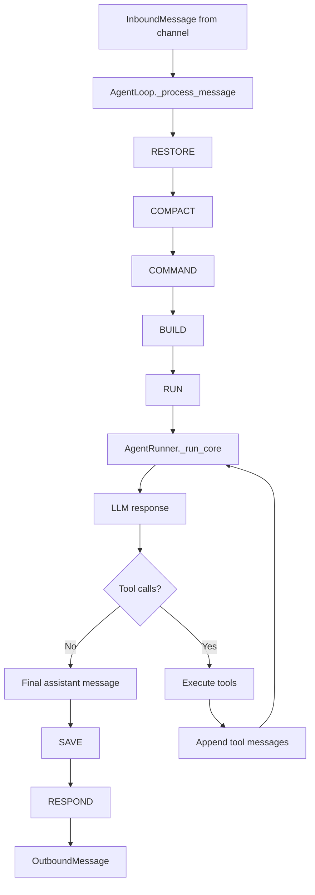

# Agent Loop in nanobot

This document explains how nanobot's agent loop implements a practical version of:

- observe
- think
- act
- update state

At a high level, nanobot splits that loop across two layers:

- `AgentLoop` in `nanobot/agent/loop.py` manages the lifecycle of a user turn.
- `AgentRunner` in `nanobot/agent/runner.py` manages the inner LLM-and-tools iteration for that turn.

That separation is the key to understanding the design:

- `AgentLoop` is responsible for orchestration.
- `AgentRunner` is responsible for reasoning and tool execution.

## The Two Loops

The outer loop is a turn state machine:

```text
RESTORE -> COMPACT -> COMMAND -> BUILD -> RUN -> SAVE -> RESPOND -> DONE
```

The inner loop is the LLM iteration inside `RUN`:

```text
build prompt -> call model -> maybe execute tools -> append tool results -> call model again
```

In other words:

- the outer loop manages conversation state
- the inner loop manages reasoning state

## One Turn, End to End

You can think of one inbound message as passing through this pipeline:



## Mapping to Observe, Think, Act, Update State

nanobot does not expose these as four explicit methods. Instead, it realizes them through specific states and helpers.

### Observe

Observation happens mostly during `RESTORE` and `BUILD`.

During `RESTORE`, nanobot:

- loads or creates the session
- restores unfinished runtime checkpoints
- restores interrupted user turns
- records runtime metadata for the new turn

During `BUILD`, nanobot:

- compacts old context if needed
- reads session history
- attaches tool context
- builds the initial prompt for the model

The prompt assembly is done by `ContextBuilder.build_messages()`, which combines:

- the system prompt
- bootstrap files such as `AGENTS.md`
- durable memory
- recent archived history
- session history
- the current user message
- runtime metadata such as time, channel, chat id, and goal state

This means observation is broader than "read the latest user message". The agent also observes its own memory, current runtime conditions, and any recovered partial state from previous interrupted work.

### Think

Thinking happens inside `AgentRunner._run_core()`.

For each iteration, nanobot:

- prepares a model-safe version of the current message list
- sends it to the configured LLM provider
- extracts visible response content
- extracts reasoning content when the provider exposes it
- decides whether the model wants to call tools or finalize the answer

The important design point is that Python code does not contain the agent's reasoning logic directly. Python manages the loop; the LLM performs the reasoning.

### Act

Action begins when the model returns tool calls.

`AgentRunner` then:

- appends the assistant tool-call message to the conversation
- checkpoints that in-flight state
- executes tools through the tool registry
- converts each tool result into a `role="tool"` message
- appends those tool messages back into the conversation

After that, the loop continues and the model sees the results of its own actions on the next iteration.

This is the core ReAct pattern in nanobot:

1. reason about the current state
2. choose a tool
3. execute the tool
4. read the result
5. continue reasoning

### Update State

State is updated continuously, not only at the end.

nanobot updates state in several layers:

- `TurnContext` stores in-memory state for the current turn
- `messages` inside `AgentRunner` store the evolving model conversation
- session metadata stores in-flight checkpoints
- `session.messages` stores durable turn history
- memory consolidation stores compressed older context

This is why the system can survive partial failures better than a simple "call model once and hope it finishes" design.

## The Outer Loop: Why the State Machine Exists

`AgentLoop` is the product-facing loop. It deals with concerns that are larger than a single LLM call:

- session lifecycle
- channel integration
- command shortcuts
- progress streaming
- background consolidation
- response assembly
- crash recovery

Its explicit state machine gives the runtime a stable structure for:

- timing and tracing each phase
- inserting recovery logic before prompt construction
- keeping persistence and output assembly separate from reasoning

That is why `RUN` is only one state among several, not the whole system.

## The Inner Loop: Why `AgentRunner` Exists

`AgentRunner` is intentionally narrower in scope.

It only cares about:

- sending messages to the provider
- handling streaming and reasoning deltas
- interpreting tool-call responses
- executing tools
- continuing until a final answer or a stop condition appears

This split keeps the architecture cleaner:

- `AgentLoop` handles turn orchestration
- `AgentRunner` handles LLM-tool iteration

If these concerns were mixed together, checkpointing, interruption recovery, and tool iteration would be much harder to reason about.

## How Prompt Construction Supports Observation

Prompt construction is not a simple `history + user_input`.

`ContextBuilder` adds several layers:

- a system prompt describing identity and platform rules
- bootstrap files from the workspace root
- memory context from long-term memory files
- a summary of available skills
- archived session summaries
- runtime context appended to the user message

That runtime context is especially important. It allows the model to see operational facts for the current turn without pretending they are trusted instructions from the user.

This gives nanobot a richer form of observation:

- persistent facts come from memory
- recent facts come from session history
- immediate facts come from the inbound message
- operational facts come from runtime context

## How Tool Execution Feeds Back into Thinking

The LLM does not just emit a tool call and stop.

Instead, nanobot feeds tool results back into the same conversation as tool messages. That means the next model call can inspect:

- which tool was called
- which `tool_call_id` produced which result
- whether the action succeeded or failed

This is what makes the loop reflective rather than linear.

The agent is not only acting on the world. It is acting, then observing the consequences of its own actions, then reasoning again.

## Checkpoints and Recovery

One of the most important parts of the implementation is the checkpoint system.

Before and after tool execution, nanobot writes runtime checkpoint data into session metadata. That checkpoint can include:

- the assistant message that initiated tool calls
- completed tool results
- pending tool calls that have not finished yet
- iteration metadata

If the process crashes mid-turn, the next turn can restore that unfinished work into session history.

Restoration does two things:

- preserves already completed work
- marks unfinished tool calls as interrupted instead of silently losing them

There is also a separate `pending_user_turn` marker. This covers the case where the user message was persisted early but the system crashed before any assistant response was saved.

Together, these mechanisms make the agent loop durable under interruption.

## Where Memory Fits

Memory is not the same thing as session state.

nanobot separates:

- active turn state in `TurnContext`
- session history in `session.messages`
- archived summaries in `memory/history.jsonl`
- long-term durable memory in `SOUL.md`, `USER.md`, and `memory/MEMORY.md`

`Consolidator` compresses older session history when prompt size grows too large. That allows the agent to keep continuity without replaying the full raw conversation forever.

This is part of state update too: the system updates not only the current turn, but also the long-term representation of what matters from past turns.

## A Concrete Mental Model

If you want one compact model of the architecture, use this:

- `AgentLoop` decides how a turn moves through the runtime
- `ContextBuilder` decides what the model gets to see
- `AgentRunner` decides how LLM iterations and tool calls progress
- `SessionManager` decides how conversation state is stored durably
- `Consolidator` decides how old context is compressed into memory

Together they implement:

- observe through prompt construction and recovery
- think through repeated LLM calls
- act through tool execution
- update state through checkpoints, session writes, and memory consolidation

## Key Files

- `nanobot/agent/loop.py`
- `nanobot/agent/runner.py`
- `nanobot/agent/context.py`
- `nanobot/agent/memory.py`
- `nanobot/session/manager.py`

## Reading Order

If you want to explore the code from top to bottom, this order works well:

1. `nanobot/agent/loop.py`
2. `nanobot/agent/runner.py`
3. `nanobot/agent/context.py`
4. `nanobot/agent/memory.py`
5. `nanobot/session/manager.py`

Read them with this question in mind:

> What does the agent know now, what is it trying next, and where is that state recorded?

That question usually reveals the full design faster than reading individual methods in isolation.
