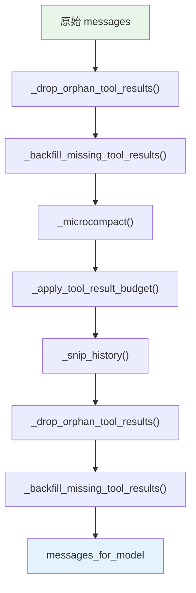
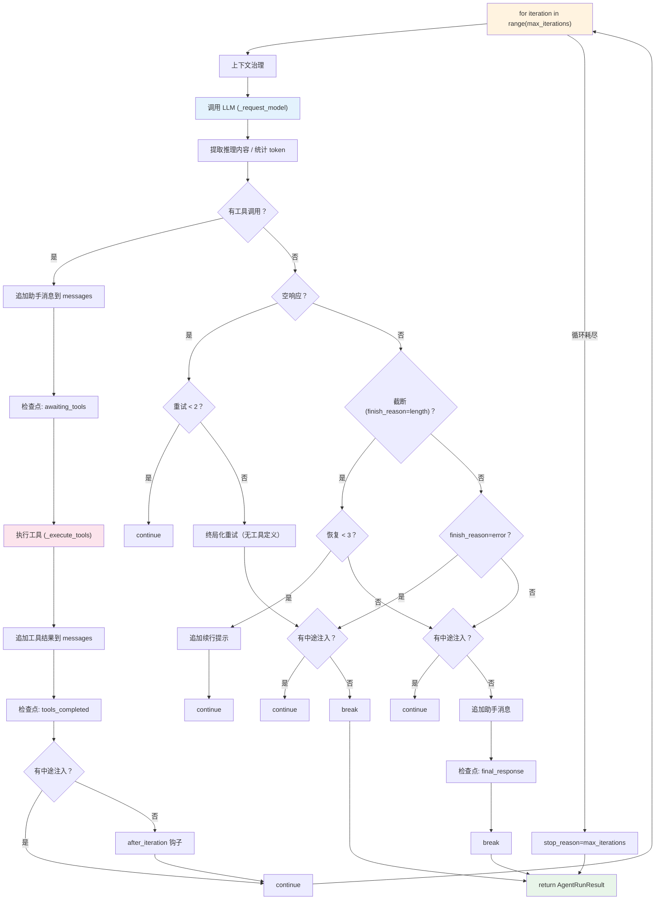

# AgentRunner 内部循环详解

本文档详细描述 `AgentRunner`（`nanobot/agent/runner.py`）如何管理 LLM 与工具之间的迭代循环。

## 定位

`AgentRunner` 是 nanobot 的推理引擎。它只关心一件事：

```text
发送消息给 LLM → 收到响应 → 有工具调用就执行 → 把结果喂回去 → 重复
```

它不关心会话持久化、通道路由、命令解析——那些都由外层 `AgentLoop` 处理。`AgentRunner` 是纯粹的"推理 + 工具"循环。

## 核心数据结构

### AgentRunSpec：执行配置

每次调用 `AgentRunner.run()` 时，通过 `AgentRunSpec` 传入所有配置：

```python
@dataclass
class AgentRunSpec:
    initial_messages: list[dict]     # 发送给 LLM 的初始消息列表
    tools: ToolRegistry              # 可用工具注册表
    model: str                       # 模型标识
    max_iterations: int              # 最大迭代次数（防止无限循环）
    max_tool_result_chars: int       # 工具结果最大字符数

    # 模型参数
    temperature: float | None
    max_tokens: int | None
    reasoning_effort: str | None

    # 钩子与回调
    hook: AgentHook | None           # 生命周期钩子
    progress_callback: Any | None    # 进度回调（用于非流式模式下的进度推送）
    retry_wait_callback: Any | None  # 重试等待回调
    checkpoint_callback: Any | None  # 检查点回调（写入 session metadata）
    injection_callback: Any | None   # 中途注入回调（获取用户新消息）

    # 控制标志
    concurrent_tools: bool           # 是否并行执行工具
    fail_on_tool_error: bool         # 工具错误是否终止循环
    stream_progress_deltas: bool     # 是否推送流式进度增量

    # 上下文管理
    context_window_tokens: int | None
    context_block_limit: int | None
    provider_retry_mode: str
    llm_timeout_s: float | None      # LLM 请求超时

    # 持续目标
    goal_active_predicate: Callable   # 判断是否有活跃的持续目标
    goal_continue_message: str | None # 持续目标的续行提示
```

### AgentRunResult：执行结果

```python
@dataclass
class AgentRunResult:
    final_content: str | None        # 最终文本响应
    messages: list[dict]             # 完整的消息列表（含所有工具交互）
    tools_used: list[str]            # 本轮使用的工具名称列表
    usage: dict[str, int]            # token 使用统计
    stop_reason: str                 # 停止原因
    error: str | None                # 错误信息
    tool_events: list[dict]          # 工具执行事件日志
    had_injections: bool             # 是否有中途注入
```

`stop_reason` 的可能值：

| 值 | 含义 |
|---|---|
| `"completed"` | 正常完成 |
| `"max_iterations"` | 达到最大迭代次数 |
| `"error"` | LLM 返回错误 |
| `"tool_error"` | 工具执行出现致命错误 |
| `"empty_final_response"` | LLM 返回空内容（重试后仍为空） |
| `"cancelled"` | 被外部取消 |

## 执行流程

### 入口：`run()`

```python
# nanobot/agent/runner.py:273-319
async def run(self, spec: AgentRunSpec) -> AgentRunResult:
    hook = spec.hook or AgentHook()
    messages = list(spec.initial_messages)
    context = AgentRunHookContext(messages=deepcopy(messages))

    try:
        await hook.before_run(context)           # 钩子：运行前
        result = await self._run_core(spec, hook, messages)
    except asyncio.CancelledError:
        context.stop_reason = "cancelled"
        raise
    except Exception as exc:
        context.stop_reason = "error"
        context.error = f"Error: {type(exc).__name__}: {exc}"
        await hook.on_error(context)             # 钩子：错误
        raise
    else:
        # 填充结果到 context
        if context.error is not None:
            await hook.on_error(context)
        await hook.after_run(context)            # 钩子：运行后
        return result
    finally:
        await hook.on_finally(context)           # 钩子：最终清理
```

`run()` 的职责很简单：设置钩子生命周期，然后委托给 `_run_core()`。

### 核心循环：`_run_core()`

这是整个推理引擎的核心。一个 `for` 循环，每次迭代完成一次"LLM 调用 + 可能的工具执行"：

```python
# nanobot/agent/runner.py:321-662
async def _run_core(self, spec, hook, messages) -> AgentRunResult:
    # ... 初始化状态变量

    for iteration in range(spec.max_iterations):
        # ① 上下文治理
        # ② 调用 LLM
        # ③ 处理响应
        #    ├─ 有工具调用 → 执行工具 → continue
        #    ├─ 空响应 → 重试或终止
        #    ├─ 输出截断 → 续行恢复
        #    ├─ 有中途注入 → continue
        #    └─ 正常完成 → break
    else:
        # ④ 达到最大迭代次数

    return AgentRunResult(...)
```

下面逐步展开。

## 逐步详解

### 第一步：上下文治理（Context Governance）

每次迭代开始前，对消息列表进行治理，确保发送给 LLM 的内容在上下文窗口内：

```python
# nanobot/agent/runner.py:342-365
messages_for_model = self._drop_orphan_tool_results(messages)
messages_for_model = self._backfill_missing_tool_results(messages_for_model)
messages_for_model = self._microcompact(messages_for_model)
messages_for_model = self._apply_tool_result_budget(spec, messages_for_model)
messages_for_model = self._snip_history(spec, messages_for_model)
# snip 可能产生新的孤立结果，再次清理
messages_for_model = self._drop_orphan_tool_results(messages_for_model)
messages_for_model = self._backfill_missing_tool_results(messages_for_model)
```

**关键设计**：治理操作作用在 `messages_for_model` 副本上，原始的 `messages` 保持不变。这样外层 `AgentLoop` 在保存轮次时，可以使用完整的原始消息列表，而不是被裁剪过的版本。

五层治理依次为：

#### 1. `_drop_orphan_tool_results()`：清除孤立工具结果

如果一条 `role="tool"` 消息的 `tool_call_id` 在之前没有任何 `role="assistant"` 消息声明过对应的 `tool_calls`，这条工具消息就是"孤立的"——可能是检查点恢复或压缩产生的残留。

```python
# 收集所有声明过的 tool_call_id
declared = set()
for msg in messages:
    if msg["role"] == "assistant":
        for tc in msg.get("tool_calls", []):
            declared.add(tc["id"])

# 移除未声明的工具结果
for msg in messages:
    if msg["role"] == "tool" and msg["tool_call_id"] not in declared:
        continue  # 丢弃
```

#### 2. `_backfill_missing_tool_results()`：补充缺失工具结果

反向检查：如果助手声明了工具调用但没有对应的工具结果，插入一条合成错误消息：

```python
{
    "role": "tool",
    "tool_call_id": call_id,
    "name": tool_name,
    "content": "[Tool result unavailable — call was interrupted or lost]"
}
```

这防止 LLM 产生"等待工具结果"的幻觉。

#### 3. `_microcompact()`：微压缩旧工具结果

对可压缩工具（`read_file`、`exec`、`grep`、`find_files`、`web_search`、`web_fetch`、`list_dir`、`list_exec_sessions`）的旧结果进行摘要化：

```python
# 只保留最近 10 条可压缩工具结果的完整内容
if len(compactable_indices) <= _MICROCOMPACT_KEEP_RECENT:
    return messages  # 不需要压缩

# 更早的结果替换为一行摘要
for idx in stale:
    if len(content) >= _MICROCOMPACT_MIN_CHARS:  # 至少 500 字符才压缩
        updated[idx]["content"] = f"[{name} result omitted from context]"
```

#### 4. `_apply_tool_result_budget()`：工具结果预算

对所有工具结果应用 `max_tool_result_chars` 限制。超长结果通过 `maybe_persist_tool_result()` 将完整内容写入文件，消息中只保留摘要。

#### 5. `_snip_history()`：历史裁剪

当估算的 token 数超过上下文窗口预算时，从旧到新裁剪消息，但保证：
- 系统消息始终保留
- 最终保留的消息以 `user` 角色开头（满足 API 的角色交替要求）
- 至少保留最近 4 条消息

### 第二步：调用 LLM

```python
# nanobot/agent/runner.py:372
response = await self._request_model(spec, messages_for_model, hook, context)
```

`_request_model()` 支持三种调用模式：

```python
# nanobot/agent/runner.py:686-822
async def _request_model(self, spec, messages, hook, context):
```

| 模式 | 条件 | 行为 |
|------|------|------|
| **流式输出** | `hook.wants_streaming()` 为 True | 通过 `on_content_delta` 实时推送内容增量，通过 `on_thinking_delta` 推送推理增量 |
| **进度流式** | 非流式但有 `progress_callback` 且 provider 支持 | 在非流式模式下模拟流式进度推送 |
| **普通调用** | 其他情况 | 调用 `provider.chat_with_retry()`，等待完整响应 |

超时处理：
- 流式请求：不应用外层超时（provider 自带空闲超时 `NANOBOT_STREAM_IDLE_TIMEOUT_S`）
- 非流式请求：应用 `llm_timeout_s`（默认 300 秒，由 `NANOBOT_LLM_TIMEOUT_S` 环境变量控制）
- 超时后返回 `LLMResponse(finish_reason="error", error_kind="timeout")`

### 第三步：处理响应

响应处理是循环中最复杂的部分，有多条分支路径：

#### 分支 A：有工具调用（`response.should_execute_tools`）

```python
# nanobot/agent/runner.py:390-479
if response.should_execute_tools:
    # 1. 构建助手消息（含 tool_calls）并追加到 messages
    assistant_message = build_assistant_message(
        response.content or "",
        tool_calls=[tc.to_openai_tool_call() for tc in response.tool_calls],
    )
    messages.append(assistant_message)

    # 2. 发出检查点（phase: "awaiting_tools"）
    await self._emit_checkpoint(spec, {
        "phase": "awaiting_tools",
        "assistant_message": assistant_message,
        "pending_tool_calls": [...],
    })

    # 3. 执行工具
    results, new_events, fatal_error = await self._execute_tools(...)

    # 4. 将工具结果追加到 messages
    for tool_call, result in zip(response.tool_calls, results):
        messages.append({
            "role": "tool",
            "tool_call_id": tool_call.id,
            "name": tool_call.name,
            "content": self._normalize_tool_result(...),
        })

    # 5. 发出检查点（phase: "tools_completed"）
    await self._emit_checkpoint(spec, {
        "phase": "tools_completed",
        "completed_tool_results": [...],
        "pending_tool_calls": [],
    })

    # 6. 检查中途注入
    # 7. continue → 进入下一次迭代
```

#### 分支 B：空响应（`is_blank_text(clean)`）

```python
# nanobot/agent/runner.py:489-519
if is_blank_text(clean):
    empty_content_retries += 1
    if empty_content_retries < _MAX_EMPTY_RETRIES:  # 最多重试 2 次
        continue  # 直接重试

    # 重试耗尽，尝试终局化重试（不带工具定义的纯文本请求）
    response = await self._request_finalization_retry(spec, messages_for_model)
    clean = hook.finalize_content(context, response.content)
```

终局化重试是一种特殊策略：去掉所有工具定义，只发送纯文本请求，强制 LLM 给出文本回复。

#### 分支 C：输出截断（`finish_reason == "length"`）

```python
# nanobot/agent/runner.py:521-540
if response.finish_reason == "length" and not is_blank_text(clean):
    length_recovery_count += 1
    if length_recovery_count <= _MAX_LENGTH_RECOVERIES:  # 最多恢复 3 次
        # 将已输出的内容作为助手消息追加
        messages.append(build_assistant_message(clean, ...))
        # 追加一条续行提示
        messages.append(build_length_recovery_message())
        continue  # 让 LLM 继续输出
```

续行提示消息（`build_length_recovery_message()`）告诉 LLM "你的上一条回复被截断了，请从断点继续"。

#### 分支 D：中途注入

```python
# nanobot/agent/runner.py:553-567
should_continue, injection_cycles = await self._try_drain_injections(
    spec, messages, assistant_message, injection_cycles,
    phase="after final response",
    iteration=iteration,
    allow_goal_continue=True,
)
if should_continue:
    had_injections = True
    # 如果有注入，将助手消息追加到 messages 并 continue
```

注入检查发生在 `on_stream_end` 之前。如果发现注入消息，流保持活跃（`resuming=True`），避免流式通道过早关闭卡片。

注入来源有两种：
1. **用户新消息**：通过 `injection_callback` 从 `pending_queue` 获取
2. **持续目标续行**：当 `goal_active_predicate()` 返回 True 时，自动注入续行提示

注入上限：每轮最多 `_MAX_INJECTION_CYCLES`（5）次注入周期，每次最多 `_MAX_INJECTIONS_PER_TURN`（3）条消息。

#### 分支 E：LLM 错误（`finish_reason == "error"`）

```python
# nanobot/agent/runner.py:569-588
if response.finish_reason == "error":
    if LLMProvider.is_arrearage_response(response):
        final_content = _ARREARAGE_ERROR_MESSAGE  # 账户欠费专用消息
    else:
        final_content = clean or spec.error_message
    stop_reason = "error"
    self._append_model_error_placeholder(messages)
    # 检查注入，可能继续
    break
```

#### 分支 F：正常完成

```python
# nanobot/agent/runner.py:607-627
messages.append(assistant_message)
await self._emit_checkpoint(spec, {
    "phase": "final_response",
    "assistant_message": messages[-1],
})
final_content = clean
break  # 退出循环
```

### 第四步：达到最大迭代次数

```python
# nanobot/agent/runner.py:628-651
else:
    # for 循环正常结束（没有 break），说明达到 max_iterations
    stop_reason = "max_iterations"
    final_content = render_template("agent/max_iterations_message.md", ...)
    self._append_final_message(messages, final_content)
    # 排空剩余注入，避免消息被重新发布到总线
    await self._try_drain_injections(spec, messages, None, injection_cycles, ...)
```

## 工具执行详解

### 并发分区：`_partition_tool_batches()`

当 `concurrent_tools=True` 时，工具调用按安全性分批：

```python
# nanobot/agent/runner.py:1442-1465
def _partition_tool_batches(self, spec, tool_calls):
    batches = []
    current = []
    for tool_call in tool_calls:
        tool = spec.tools.get(tool_call.name)
        if tool and tool.concurrency_safe:
            current.append(tool_call)      # 安全的工具归入同一批
        else:
            if current:
                batches.append(current)    # 提交当前批次
                current = []
            batches.append([tool_call])    # 不安全的工具单独一批
    if current:
        batches.append(current)
    return batches
```

分区内并发执行，分区间串行。`concurrency_safe` 标记在工具定义中声明。

```python
# nanobot/agent/runner.py:913-948
async def _execute_tools(self, spec, tool_calls, ...):
    batches = self._partition_tool_batches(spec, tool_calls)
    for batch in batches:
        if spec.concurrent_tools and len(batch) > 1:
            # 同一批内并发执行
            batch_results = await asyncio.gather(*(
                self._run_tool(spec, tc, ...) for tc in batch
            ))
        else:
            # 串行执行
            for tool_call in batch:
                result = await self._run_tool(spec, tool_call, ...)
```

### 单工具执行：`_run_tool()`

```python
# nanobot/agent/runner.py:950-1099
async def _run_tool(self, spec, tool_call, external_lookup_counts, workspace_violation_counts):
```

执行流程：

1. **重复外部查询检查**：如果同一个外部查询（同名工具 + 相同参数）已经被调用过多次，直接返回错误，避免无限重试。

2. **工具准备**（`prepare_call`）：工具注册表可以在此阶段进行参数验证、权限检查等。如果返回错误，进入违规分类。

3. **文件编辑事件追踪**：如果进度回调支持文件编辑事件，启动 `StreamingFileEditTracker` 追踪文件修改的实时进度。

4. **执行工具**：
   ```python
   if tool is not None:
       result = await tool.execute(**params)    # 已预解析的工具
   else:
       result = await spec.tools.execute(tool_call.name, params)  # 从注册表查找
   ```

5. **结果标准化**（`_normalize_tool_result()`）：
   - 空结果替换为 `(empty)` 占位符
   - 超长结果尝试持久化到文件
   - 最终截断到 `max_tool_result_chars`

6. **违规分类**（`_classify_violation()`）：

   当工具返回错误时，检查是否属于安全边界违规：

   | 类型 | 处理方式 |
   |------|---------|
   | **SSRF 违规** | 返回不可重试的错误 + 安全边界说明 |
   | **工作区违规** | 首次返回软错误；重复时升级提示 |
   | **普通错误** | 返回错误信息 + 重试提示 |

   SSRF 违规的特殊处理：返回 `_SSRF_BOUNDARY_NOTE`，明确告诉 LLM 不要尝试绕过（不要用 curl、wget、编码 IP 等方式重试）。

### 检查点机制

检查点在三个关键时机发出：

```python
# 1. 工具执行前 — "awaiting_tools"
{"phase": "awaiting_tools", "assistant_message": ..., "pending_tool_calls": [...]}

# 2. 工具执行后 — "tools_completed"
{"phase": "tools_completed", "assistant_message": ..., "completed_tool_results": [...], "pending_tool_calls": []}

# 3. 最终响应 — "final_response"
{"phase": "final_response", "assistant_message": ..., "completed_tool_results": [], "pending_tool_calls": []}
```

检查点通过 `spec.checkpoint_callback` 传给外层 `AgentLoop`，由 `_set_runtime_checkpoint()` 写入 `session.metadata`。如果进程崩溃，下次启动时 `_restore_runtime_checkpoint()` 会恢复这些数据。

## 上下文治理管线图



```text
原始 messages（完整历史）
  ↓
① 移除孤立工具结果（无对应 tool_call 的 tool 消息）
  ↓
② 补充缺失工具结果（有 tool_call 无 tool 结果 → 插入占位符）
  ↓
③ 微压缩（旧的可压缩工具结果 → 一行摘要）
  ↓
④ 工具结果预算（超长结果 → 截断/持久化）
  ↓
⑤ 历史裁剪（估算 token 超限 → 从旧到新裁剪）
  ↓
⑥ 再次清理（裁剪可能产生新的孤立/缺失）
  ↓
messages_for_model（发送给 LLM）
```

## 完整迭代循环流程图



## 钩子生命周期

`AgentHook` 在循环的多个时机被调用：

```text
before_run
  └─ for each iteration:
       before_iteration
       ├─ [工具调用分支]
       │    on_stream_end(resuming=True)
       │    before_execute_tools
       │    after_iteration
       │    continue
       ├─ [空响应分支]
       │    on_stream_end(resuming=False)
       │    after_iteration
       │    continue / break
       ├─ [截断分支]
       │    on_stream_end(resuming=True)
       │    after_iteration
       │    continue
       └─ [正常完成分支]
            on_stream_end(resuming=False)
            after_iteration
            break
  after_run / on_error
  on_finally
```

钩子实现（`AgentProgressHook`）负责：
- 将流式增量推送给 `on_stream` 回调
- 将推理内容推送给 `on_stream`（作为特殊格式）
- 管理文件编辑事件的进度推送
- 在迭代切换时通知 `on_stream_end`

## 关键设计决策

### 为什么治理管线要作用在副本上？

`messages_for_model` 是治理后的版本，可能被裁剪、压缩、修改。但 `AgentLoop._save_turn()` 需要保存完整的原始消息到会话历史。如果治理直接修改原始列表，保存的历史会丢失信息。

### 为什么有两个层面的"孤立处理"？

- `_drop_orphan_tool_results`：移除没有声明的工具结果（工具结果多了）
- `_backfill_missing_tool_results`：补充没有结果的工具调用（工具结果少了）

这两个方向的问题都可能由检查点恢复、压缩、或手动编辑历史产生。先删后补，确保消息列表在 API 调用层面是合法的。

### 为什么空响应要尝试"终局化重试"？

某些 LLM 在有工具定义时可能返回空内容（尤其是当它们"选择"不调用工具但也不知道说什么时）。去掉工具定义，强制纯文本请求，通常能引出正常回复。

### 为什么注入检查在 `on_stream_end` 之前？

如果先关闭流再发现有注入消息，流式通道（如飞书卡片）会认为回答已经结束。保持流活跃可以让后续的注入响应无缝衔接。

### 为什么 SSRF 违规是不可重试的？

SSRF（服务端请求伪造）是安全硬边界。如果 LLM 尝试访问内部/私有 URL，错误消息中必须明确告知"不要绕过"，否则 LLM 可能会尝试用编码 IP、DNS 重绑定、代理等方式绕过防护。

## 与 AgentLoop 的交互边界

```text
┌─────────────────────────────────────────────────┐
│                   AgentLoop                      │
│                                                  │
│  RESTORE ── COMPACT ── COMMAND ── BUILD ── RUN   │
│                                          │       │
│                                    ┌─────┴─────┐ │
│                                    │AgentRunner│ │
│                                    │           │ │
│                                    │  LLM 调用  │ │
│                                    │  工具执行   │ │
│                                    │  检查点回调 │ │
│                                    │  注入回调   │ │
│                                    └─────┬─────┘ │
│                                          │       │
│  SAVE ── RESPOND ── DONE                 │       │
│                                                  │
│  checkpoint_callback ← ─── _emit_checkpoint       │
│  injection_callback  ← ─── _drain_injections      │
│  progress_callback   ← ─── hook.on_stream         │
│                                                  │
└─────────────────────────────────────────────────┘
```

| 回调 | 方向 | 用途 |
|------|------|------|
| `checkpoint_callback` | Runner → Loop | 将执行进度写入 session metadata |
| `injection_callback` | Runner → Loop | 从 pending_queue 获取用户新消息 |
| `progress_callback` | Runner → Loop → Bus | 推送工具执行进度（如文件编辑事件） |
| `hook.on_stream` | Runner → Loop → Channel | 推送流式内容增量 |
| `hook.on_stream_end` | Runner → Loop → Channel | 通知流式段结束 |

## 相关文件

| 文件 | 职责 |
|------|------|
| `nanobot/agent/runner.py` | LLM 与工具的迭代循环 |
| `nanobot/agent/loop.py` | 轮次状态机、会话管理 |
| `nanobot/agent/hook.py` | `AgentHook` 接口定义 |
| `nanobot/agent/progress_hook.py` | `AgentProgressHook` 实现 |
| `nanobot/agent/tools/registry.py` | 工具注册与执行 |
| `nanobot/providers/base.py` | `LLMProvider`、`LLMResponse`、`ToolCallRequest` |
| `nanobot/utils/runtime.py` | 空响应消息、续行提示、违规检测等运行时工具 |
| `nanobot/utils/helpers.py` | token 估算、推理提取、工具结果持久化等通用工具 |
