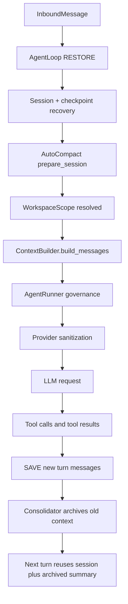

# Context Management in nanobot

This document explains how nanobot manages context internally.

It focuses on five questions:

- what kinds of context nanobot keeps
- where each kind of context lives
- how context is assembled for one model call
- how context is trimmed, repaired, restored, and persisted
- how workspace and runtime boundaries are enforced across turns

At a high level, nanobot does not treat context as a single prompt string.

It treats context as a layered runtime system.

Those layers have different lifetimes:

- request context exists for one in-flight turn
- session context persists the replayable conversation tail
- memory context archives older information and long-term facts
- workspace context decides which project root and access mode apply
- model runtime context decides which provider, model, and token budget govern the turn

`AgentLoop`, `ContextBuilder`, `AgentRunner`, `SessionManager`, and `Consolidator` work together to turn those layers into one model-visible request.

## The Big Picture

The simplest mental model is this:

- `AgentLoop` owns the runtime state for one bot instance
- `SessionManager` stores replayable turn history on disk
- `MemoryStore` and `Consolidator` store long-term and archived context
- `WorkspaceScopeResolver` decides which workspace the current turn runs against
- `ContextBuilder` assembles the model-visible prompt and messages
- `AgentRunner` repairs, budgets, and trims that context before each LLM request
- the provider layer performs final transport-safe cleanup before the HTTP call

That means "context management" in nanobot is not one subsystem.

It is the combined behavior of:

- persistence
- runtime binding
- prompt construction
- budget enforcement
- interruption recovery
- safety-boundary enforcement

## One Turn, End to End

You can think of one turn as moving through this pipeline:

## The Main Pieces

The context system is easiest to understand by walking through each layer and its owner.

### Request Context: per-turn routing metadata

`RequestContext` is the smallest and shortest-lived context object.

It carries information such as:

- channel
- chat id
- message id
- session key
- turn-local metadata

Its purpose is not model prompting.

Its purpose is tool routing.

`AgentLoop._set_tool_context()` pushes that data into tools that implement `ContextAware`, and `_run_agent_loop()` also binds the same payload into `contextvars` through `bind_request_context()`.

That makes shared tool instances safe to reuse across turns and async tasks.

Source entry points:

- [`RequestContext`](../nanobot/agent/tools/context.py#L15-L21), [`ContextAware`](../nanobot/agent/tools/context.py#L25-L27), [`bind_request_context()`](../nanobot/agent/tools/context.py#L30-L31), [`current_request_context()`](../nanobot/agent/tools/context.py#L38-L39)
- [`_set_tool_context()`](../nanobot/agent/loop.py#L505-L531), [`_run_agent_loop()`](../nanobot/agent/loop.py#L661-L840)
- [`MessageTool.set_context()`](../nanobot/agent/tools/message.py#L102-L107)

### Session Context: replayable conversation state

`Session` is nanobot's persistent replay buffer.

It stores:

- the raw message sequence for a conversation
- session metadata
- the `last_consolidated` boundary that separates replayable tail from archived prefix

`Session.get_history()` does not simply return the full message list.

It prepares a model-safe replay slice by:

- taking the unconsolidated tail
- preferring to start at a user turn
- dropping illegal tool-result prefixes
- skipping command-only messages
- synthesizing breadcrumbs for image attachments, CLI apps, and MCP presets
- optionally annotating user turns with `[Message Time: ...]`
- enforcing a token budget from the tail

So session context is already a curated replay form, not a raw transcript dump.

Source entry points:

- [`Session`](../nanobot/session/manager.py#L92-L355), [`get_history()`](../nanobot/session/manager.py#L141-L272), [`retain_recent_legal_suffix()`](../nanobot/session/manager.py#L281-L355)
- [`_state_build()`](../nanobot/agent/loop.py#L1380-L1424), [`_save_turn()`](../nanobot/agent/loop.py#L1554-L1599)

### Memory Context: long-term and archived context

`MemoryStore` owns the file-based long-term context.

It manages:

- `memory/MEMORY.md`
- `memory/history.jsonl`
- `SOUL.md`
- `USER.md`

Those files serve different roles:

- `MEMORY.md` stores long-term facts
- `history.jsonl` stores archived summaries and raw fallbacks
- `SOUL.md` and `USER.md` provide persona and user-specific bootstrap context

`Consolidator` sits above `MemoryStore`.

It measures prompt growth against the active context window, chooses safe user-turn boundaries, summarizes older chunks through the active provider, and advances `session.last_consolidated`.

The latest archive summary is also written to `session.metadata["_last_summary"]` so the next turn can inject it back into the system prompt as archived context.

Source entry points:

- [`MemoryStore`](../nanobot/agent/memory.py#L40-L554), [`get_memory_context()`](../nanobot/agent/memory.py#L229-L231)
- [`Consolidator`](../nanobot/agent/memory.py#L555-L955), [`archive()`](../nanobot/agent/memory.py#L746-L779), [`maybe_consolidate_by_tokens()`](../nanobot/agent/memory.py#L781-L889)
- [`prepare_session()`](../nanobot/agent/autocompact.py#L80-L96)

### Workspace Context: effective project root and access mode

`WorkspaceScope` captures which project the current turn is operating on and whether access is restricted.

This is distinct from request context.

Request context answers:

- who sent the turn
- where replies should go

Workspace context answers:

- which project root the model should see
- whether tools are restricted to that root
- whether the runtime is enforcing the boundary at system or application level

`WorkspaceScopeResolver` resolves the effective scope from:

- message metadata
- falling back to session metadata
- falling back again to the default workspace

The resolved scope is then:

- passed into `ContextBuilder` so the prompt shows the right workspace path
- bound with `bind_workspace_scope()` so tools read the same scope at execution time

That keeps "model-visible workspace" and "tool-allowed workspace" aligned.

Source entry points:

- [`WorkspaceScope`](../nanobot/security/workspace_access.py#L66-L91), [`WorkspaceScopeResolver`](../nanobot/security/workspace_access.py#L110-L164), [`resolve_effective_workspace_scope()`](../nanobot/security/workspace_access.py#L317-L337)
- [`bind_workspace_scope()`](../nanobot/security/workspace_access.py#L340-L345), [`current_tool_workspace()`](../nanobot/security/workspace_access.py#L352-L375)
- [`_FsTool._resolve()`](../nanobot/agent/tools/filesystem.py#L76-L87)
- [`ShellTool._prepare_command()`](../nanobot/agent/tools/shell.py#L356-L429)

### Model Runtime Context: provider, model, and token window

`AgentLoop` also owns the active model runtime:

- provider instance
- model name
- context window tokens
- generation defaults derived from the current preset

This layer is mutable at runtime.

`_refresh_provider_snapshot()` reloads the active provider configuration, and `_apply_provider_snapshot()` updates the loop, the runner, subagents, and the consolidator together.

That matters because context management depends on the current model window:

- replay budget depends on it
- consolidation thresholds depend on it
- prompt snipping depends on it

Source entry points:

- [`ProviderSnapshot`](../nanobot/providers/factory.py#L15-L20), [`build_provider_snapshot()`](../nanobot/providers/factory.py#L215-L231)
- [`_apply_provider_snapshot()`](../nanobot/agent/loop.py#L393-L422), [`_refresh_provider_snapshot()`](../nanobot/agent/loop.py#L424-L446)
- [`LLMRuntime`](../nanobot/utils/llm_runtime.py#L12-L17)

## How Context Is Built For the Model

`ContextBuilder` assembles the final model-visible message list.

It does that in two layers.

First, `build_system_prompt()` builds the system prompt from:

- identity and platform policy
- workspace bootstrap files such as `AGENTS.md`, `SOUL.md`, and `USER.md`
- the tool contract template
- long-term memory from `MEMORY.md`
- always-on skills and the general skills summary
- recent unprocessed memory history
- the archived session summary

Second, `build_messages()` builds the full message list:

- one system message from `build_system_prompt()`
- replay history from `Session.get_history()`
- the current user turn merged with runtime metadata

That last step is subtle and important.

Runtime metadata such as current time, channel, chat id, sender id, goal state lines, CLI runtime lines, and MCP runtime lines is appended as a tagged metadata block after the current user content.

The block is explicitly marked as metadata rather than instructions.

It is also appended after the user content so the user-content prefix stays stable for prompt-cache hits.

Source entry points:

- [`ContextBuilder`](../nanobot/agent/context.py#L51-L270), [`build_system_prompt()`](../nanobot/agent/context.py#L66-L111), [`build_messages()`](../nanobot/agent/context.py#L181-L245)
- [`_build_runtime_context()`](../nanobot/agent/context.py#L129-L145), [`runtime_lines()`](../nanobot/agent/context.py#L30-L40), [`session_extra()`](../nanobot/agent/context.py#L25-L27)
- [`_build_initial_messages()`](../nanobot/agent/loop.py#L590-L613)

## How Context Is Governed Before Each LLM Call

The prompt assembled by `ContextBuilder` is still not the exact payload sent to the model.

`AgentRunner._run_core()` applies another context-governance layer before every model request.

That layer does four main things:

1. repair tool-message structure
2. compact stale tool results
3. enforce per-turn tool-result budgets
4. snip history to fit the active context window

Concretely, the runner applies:

- `_drop_orphan_tool_results()`
- `_backfill_missing_tool_results()`
- `_microcompact()`
- `_apply_tool_result_budget()`
- `_snip_history()`

This is a key design decision.

The persisted conversation is left untouched.

Only the model-facing copy is repaired or compacted, so prompt hygiene does not mutate the append boundary used for later persistence.

Source entry points:

- [`_run_core()`](../nanobot/agent/runner.py#L321-L657)
- [`_drop_orphan_tool_results()`](../nanobot/agent/runner.py#L1194-L1217), [`_backfill_missing_tool_results()`](../nanobot/agent/runner.py#L1220-L1258)
- [`_microcompact()`](../nanobot/agent/runner.py#L1261-L1284), [`_apply_tool_result_budget()`](../nanobot/agent/runner.py#L1286-L1305), [`_snip_history()`](../nanobot/agent/runner.py#L1307-L1379)

## How the Provider Sees the Final Context

After runner-level governance, the provider layer performs one more cleanup pass.

`LLMProvider` utilities sanitize outbound messages by:

- normalizing empty content
- stripping internal `_meta` fields from multimodal blocks
- keeping only provider-safe message keys
- merging consecutive same-role messages when needed
- removing illegal trailing assistant messages
- inserting a synthetic user message if truncation would otherwise start with a bare assistant message

So the model sees:

- prompt-built context
- runner-governed history
- provider-safe transport formatting

not the raw session file.

Source entry points:

- [`_sanitize_empty_content()`](../nanobot/providers/base.py#L173-L219)
- [`_sanitize_request_messages()`](../nanobot/providers/base.py#L254-L265), [`_enforce_role_alternation()`](../nanobot/providers/base.py#L397-L463)
- [`_request_model()`](../nanobot/agent/runner.py#L681-L817)

## How Interruptions Are Restored

nanobot persists partial turn progress so a crash or interruption does not leave history in an impossible state.

Two mechanisms are involved.

First, `AgentRunner` emits checkpoints while a tool-using turn is in progress.

Second, `AgentLoop` restores those checkpoints at the next turn boundary.

`_restore_runtime_checkpoint()` materializes:

- the assistant message that declared tool calls
- any completed tool results
- synthetic error tool messages for tool calls that were still pending

`_restore_pending_user_turn()` closes the other failure mode:

- a user message was persisted early
- but the assistant response never made it to disk

In that case nanobot appends a synthetic assistant error reply so the session remains well-formed.

Source entry points:

- [`_emit_checkpoint()`](../nanobot/agent/runner.py#L1133-L1140)
- [`_restore_runtime_checkpoint()`](../nanobot/agent/loop.py#L1652-L1704), [`_restore_pending_user_turn()`](../nanobot/agent/loop.py#L1706-L1724)
- [`_persist_user_message_early()`](../nanobot/agent/loop.py#L566-L588)

## How New Context Is Persisted After the Turn

After the run finishes, `AgentLoop._save_turn()` appends only the new-turn suffix to the session.

Before it writes, it strips or bounds volatile data:

- runtime context blocks are removed from persisted user messages
- oversized tool results are truncated
- inline image blocks are replaced with breadcrumbs
- empty assistant messages without useful structure are skipped

This keeps session history:

- replayable
- bounded
- mostly provider-neutral
- free of transient runtime annotations

After that, `Session.enforce_file_cap()` can trim old prefixes, and background consolidation may archive them into memory.

Source entry points:

- [`_save_turn()`](../nanobot/agent/loop.py#L1554-L1599), [`_sanitize_persisted_blocks()`](../nanobot/agent/loop.py#L1514-L1552)
- [`SessionManager.save()`](../nanobot/session/manager.py#L546-L594), [`Session.enforce_file_cap()`](../nanobot/session/manager.py#L357-L379)

## Why Shared Tool Instances Still Work Safely

nanobot reuses tool instances, but turn-local state remains isolated because short-lived context is bound through `contextvars`.

That pattern shows up in multiple places:

- `RequestContext` for routing
- workspace scope for access control
- file-state tracking for edit-aware tools
- per-tool local vars such as `MessageTool` defaults

The tests around sustained-goal tools confirm this design intention: concurrent tasks can switch request contexts without bleeding state across sessions.

Source entry points:

- [`bind_request_context()`](../nanobot/agent/tools/context.py#L30-L31)
- [`bind_workspace_scope()`](../nanobot/security/workspace_access.py#L340-L345)
- [`MessageTool.start_turn()`](../nanobot/agent/tools/message.py#L113-L116)
- [`test_goal_tools_keep_request_context_per_task()`](../tests/agent/tools/test_long_task.py#L79-L102)

## Extension Points

If you need to change how context behaves, the main extension points are:

- `ContextBuilder` when you need to change what the model sees
- `Session.get_history()` when you need to change replay rules
- `Consolidator` when you need to change archival strategy
- `WorkspaceScopeResolver` when you need different project-selection rules
- `AgentRunner` when you need different context budgeting or repair behavior
- provider utilities when a backend needs stricter message normalization

The key architectural rule is to modify the correct layer.

Examples:

- add a new runtime metadata line in `ContextBuilder`, not in `Session`
- change legal replay boundaries in `Session`, not in the provider layer
- change trimming and repair policy in `AgentRunner`, not in persistence
- change workspace access rules in `workspace_access.py`, not in individual tools

## How to Read the System

If you want to study the implementation from the source, this order works well:

1. [`nanobot/agent/context.py:L25-L270`](../nanobot/agent/context.py#L25-L270)
2. [`nanobot/session/manager.py:L92-L594`](../nanobot/session/manager.py#L92-L594)
3. [`nanobot/agent/memory.py:L40-L955`](../nanobot/agent/memory.py#L40-L955)
4. [`nanobot/agent/autocompact.py:L17-L96`](../nanobot/agent/autocompact.py#L17-L96)
5. [`nanobot/security/workspace_access.py:L66-L375`](../nanobot/security/workspace_access.py#L66-L375)
6. [`nanobot/agent/loop.py:L393-L1724`](../nanobot/agent/loop.py#L393-L1724)
7. [`nanobot/agent/runner.py:L83-L1379`](../nanobot/agent/runner.py#L83-L1379)
8. [`nanobot/providers/base.py:L173-L463`](../nanobot/providers/base.py#L173-L463)
9. [`nanobot/agent/tools/context.py:L15-L60`](../nanobot/agent/tools/context.py#L15-L60)

## Compact Mental Model

If you want one compact summary, it is this:

- `Session` keeps the recent replayable tail
- `Memory` keeps the old and durable context
- `WorkspaceScope` chooses where the turn is allowed to act
- `RequestContext` chooses where tools should route work
- `ContextBuilder` turns those layers into prompt-visible context
- `AgentRunner` repairs and budgets that context before each call
- the provider layer makes the final payload acceptable to one backend

So nanobot's context strategy is not "store everything and send everything".

It is:

- store different context at different lifetimes
- replay only the legal and relevant tail
- archive what no longer fits
- inject runtime metadata only for the current turn
- keep execution boundaries aligned with the context the model sees
