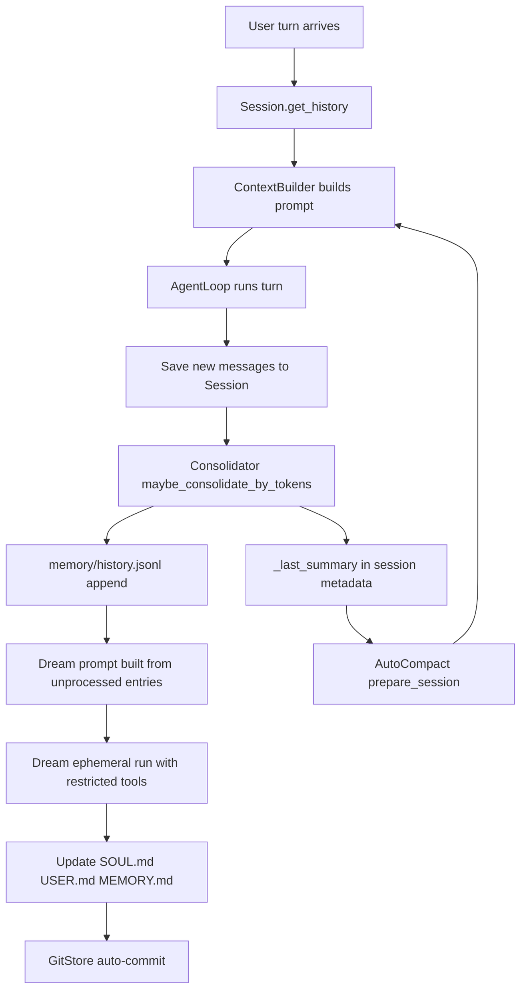

# Memory System in nanobot

This document explains how nanobot's memory system is implemented in the current repository.

It focuses on five questions:

- where short-term, archived, and durable memory each live
- how normal conversation turns get compressed
- how Dream turns archived history into long-term file edits
- how idle sessions are compacted and later rehydrated
- how memory changes remain inspectable and reversible

At a high level, nanobot does not treat memory as a single store.

It uses a pipeline with different lifetimes:

- `Session` keeps the recent replayable tail
- `Consolidator` converts old session prefixes into archive entries
- `memory/history.jsonl` stores those archive entries with monotonic cursors
- Dream consumes archive entries and edits durable memory files
- `AutoCompact` handles idle-session compression and summary reinjection
- `GitStore` versions durable memory changes for inspection and restore

## The Big Picture

The simplest mental model is this:

- normal turns write into `Session.messages`
- token pressure or replay overflow moves old turns into `memory/history.jsonl`
- Dream periodically reads unprocessed archive entries and updates `SOUL.md`, `USER.md`, and `memory/MEMORY.md`
- idle sessions can be compacted early even without an active user turn
- the next turn can inject the last archived summary back into the prompt

So memory in nanobot is not just storage.

It is the combined behavior of:

- replay
- archival
- delayed interpretation
- summary reinjection
- versioned durable edits

## One Memory Cycle

You can think of the system as two linked loops:



## The Main Pieces

### Live Session Memory: replayable short-term context

`Session` is the live conversation buffer.

It stores:

- the current message sequence
- session metadata
- `last_consolidated`, which marks the archived prefix boundary

That boundary matters because memory is not removed from the session all at once.

Instead, nanobot archives an old prefix and keeps replaying the newer suffix.

`Session.get_history()` returns a curated replay slice rather than the raw full transcript.
`retain_recent_legal_suffix()` and `enforce_file_cap()` provide the other half of that contract:

- preserve legal replay boundaries
- keep a recent suffix when compacting
- archive only the dropped unconsolidated prefix when needed

Source entry points:

- [`Session`](../nanobot/session/manager.py#L92-L379), [`get_history()`](../nanobot/session/manager.py#L141-L272)
- [`retain_recent_legal_suffix()`](../nanobot/session/manager.py#L281-L355), [`enforce_file_cap()`](../nanobot/session/manager.py#L357-L379)
- [`SessionManager.save()`](../nanobot/session/manager.py#L546-L594)

### MemoryStore: durable files and archive log

`MemoryStore` owns the file-level memory substrate.

It manages:

- `memory/MEMORY.md`
- `memory/history.jsonl`
- `memory/.cursor`
- `memory/.dream_cursor`
- `SOUL.md`
- `USER.md`

Those files serve different roles:

- `MEMORY.md` stores durable project or task facts
- `SOUL.md` stores stable agent identity and style
- `USER.md` stores user-specific durable knowledge
- `history.jsonl` stores append-only archived summaries or raw fallbacks
- `.cursor` tracks the latest archive write
- `.dream_cursor` tracks how far Dream has consumed archive history

`MemoryStore` also contains the migration path from legacy `HISTORY.md` into `history.jsonl`, so the operational archive format is now JSONL with integer cursors.

Source entry points:

- [`MemoryStore`](../nanobot/agent/memory.py#L40-L542)
- [`_maybe_migrate_legacy_history()`](../nanobot/agent/memory.py#L82-L120)
- [`get_memory_context()`](../nanobot/agent/memory.py#L229-L231), [`append_history()`](../nanobot/agent/memory.py#L235-L278)
- [`read_unprocessed_history()`](../nanobot/agent/memory.py#L321-L323), [`compact_history()`](../nanobot/agent/memory.py#L325-L333)
- [`get_last_dream_cursor()`](../nanobot/agent/memory.py#L397-L401), [`set_last_dream_cursor()`](../nanobot/agent/memory.py#L403-L404)

### Consolidator: turn-time archival under token pressure

`Consolidator` is the fast memory path used during normal agent turns.

Its job is not to edit long-term memory files directly.

Its job is to keep the active prompt small enough by converting older session slices into archive entries.

It does that in three stages:

1. estimate prompt size from the full unconsolidated session tail
2. choose a safe user-turn boundary to archive
3. summarize that chunk into `history.jsonl`, or raw-dump it on LLM failure

Two details are especially important:

- `estimate_session_prompt_tokens()` includes the current `_last_summary`, so token budgeting sees the real future prompt shape
- `maybe_consolidate_by_tokens()` advances `session.last_consolidated` even when summarization degrades to `raw_archive()`, preventing duplicate raw re-archives of the same chunk

The consolidator also handles replay-window overflow, not just hard token overflow.

That means messages which would disappear from `get_history()` due to replay limits are materialized into archive history before they become invisible.

Source entry points:

- [`Consolidator`](../nanobot/agent/memory.py#L555-L955)
- [`pick_consolidation_boundary()`](../nanobot/agent/memory.py#L602-L623), [`estimate_session_prompt_tokens()`](../nanobot/agent/memory.py#L701-L725)
- [`archive()`](../nanobot/agent/memory.py#L746-L779), [`maybe_consolidate_by_tokens()`](../nanobot/agent/memory.py#L781-L889)
- [`raw_archive()`](../nanobot/agent/memory.py#L492-L503), [`_persist_last_summary()`](../nanobot/agent/memory.py#L693-L700)

### AutoCompact: idle-session compression and summary rehydration

`AutoCompact` is the slow memory path for sessions that have gone idle.

It watches session age against `session_ttl_minutes` and schedules background archival for expired sessions.

That archival delegates to `Consolidator.compact_idle_session()`, which:

- keeps only a recent legal suffix
- archives the dropped portion
- resets `last_consolidated`
- stores `_last_summary` in session metadata

On the next user turn, `prepare_session()` can inject that summary back as a one-shot "previous conversation summary" block.

This is why memory reinjection is split across two places:

- the consolidator writes `_last_summary`
- `AutoCompact.prepare_session()` decides when to rehydrate it for prompting

Source entry points:

- [`AutoCompact`](../nanobot/agent/autocompact.py#L17-L96)
- [`check_expired()`](../nanobot/agent/autocompact.py#L45-L58), [`_archive()`](../nanobot/agent/autocompact.py#L59-L79), [`prepare_session()`](../nanobot/agent/autocompact.py#L80-L96)
- [`compact_idle_session()`](../nanobot/agent/memory.py#L890-L955)

### Dream: converting archive history into durable memory edits

Dream is the second memory loop.

Unlike the consolidator, Dream does not summarize the active session.

Instead, it consumes unread entries from `history.jsonl`, builds an internal prompt, and runs an `ephemeral` agent turn with a restricted tool registry.

That Dream tool registry is intentionally narrow:

- `read_file`
- `edit_file`
- `apply_patch`
- `write_file`

And the writable roots are intentionally narrow as well:

- `memory/`
- `SOUL.md`
- `USER.md`
- `skills/`

Dream only advances `.dream_cursor` after the ephemeral run ends cleanly.

So the archive-consumption cursor means "successfully processed by Dream", not merely "prompt was built".

Source entry points:

- [`build_dream_prompt()`](../nanobot/agent/memory.py#L406-L428), [`build_dream_tools()`](../nanobot/agent/memory.py#L430-L470), [`dream_run_completed()`](../nanobot/agent/memory.py#L473-L476)
- [`cmd_dream()`](../nanobot/command/builtin.py#L306-L367)
- [`on_cron_job()` dream branch](../nanobot/cli/commands.py#L985-L1029)

### Prompt Reinjection: how memory returns to the model

Memory becomes model-visible in two different ways.

First, `ContextBuilder.build_system_prompt()` injects durable long-term memory from `MEMORY.md`.

Second, it injects recent unprocessed `history.jsonl` entries that Dream has not consumed yet.

That means the archive log is not only a Dream input.

It is also a temporary prompt input while entries remain newer than `.dream_cursor`.

The next-turn archived summary from `AutoCompact.prepare_session()` is passed in as `session_summary`, so old session context can reappear in prompt form even after compaction.

Source entry points:

- [`build_system_prompt()`](../nanobot/agent/context.py#L66-L111), [`build_messages()`](../nanobot/agent/context.py#L181-L245)
- [`_build_initial_messages()`](../nanobot/agent/loop.py#L590-L613)
- [`_state_compact()`](../nanobot/agent/loop.py#L1350-L1353), [`_state_build()`](../nanobot/agent/loop.py#L1380-L1424)

### AgentLoop Wiring: where the memory pieces connect

`AgentLoop` is where the whole memory system is assembled.

In `__init__()` it wires together:

- `ContextBuilder`
- `SessionManager`
- `Consolidator`
- `AutoCompact`

During a normal turn the sequence is:

1. restore and compact session state
2. optionally run preflight token consolidation
3. build prompt and history
4. run the agent
5. save the new turn
6. enforce the hard session file cap
7. schedule background consolidation

The same pattern also appears in `_process_system_message()` for system-originated turns such as subagent follow-ups.

Source entry points:

- [`AgentLoop.__init__()`](../nanobot/agent/loop.py#L178-L322)
- [`_process_system_message()`](../nanobot/agent/loop.py#L1089-L1181)
- [`_state_compact()`](../nanobot/agent/loop.py#L1350-L1353), [`_state_build()`](../nanobot/agent/loop.py#L1380-L1424), [`_state_save()`](../nanobot/agent/loop.py#L1460-L1495)

## Two Memory Loops

The system is easiest to understand if you separate the two loops clearly.

### Fast loop: keep active conversations under budget

This is the live-turn path:

- read `Session`
- estimate replay and prompt pressure
- archive an old prefix into `history.jsonl`
- keep a replayable suffix in session
- optionally inject the latest summary next turn

This loop is owned by `Session`, `Consolidator`, `AutoCompact`, and `AgentLoop`.

### Slow loop: turn archives into durable knowledge

This is the Dream path:

- read `history.jsonl` entries newer than `.dream_cursor`
- run a restricted ephemeral agent
- edit durable memory files
- advance `.dream_cursor` only on success
- optionally auto-commit the durable file changes

This loop is owned by `MemoryStore`, the Dream command / cron entrypoints, and `GitStore`.

## File Layout

The key memory files are:

```text
workspace/
├── SOUL.md
├── USER.md
└── memory/
    ├── MEMORY.md
    ├── history.jsonl
    ├── .cursor
    └── .dream_cursor
```

Their operational meaning is:

- `SOUL.md`: stable agent voice and working style
- `USER.md`: stable user facts and preferences
- `memory/MEMORY.md`: durable project or task memory
- `memory/history.jsonl`: append-only machine-oriented archive stream
- `memory/.cursor`: last archive write cursor
- `memory/.dream_cursor`: last Dream-consumed archive cursor

## Commands and Versioning

The user-visible Dream commands are:

- `/dream`
- `/dream-log`
- `/dream-log <sha>`
- `/dream-restore`
- `/dream-restore <sha>`

These exist because Dream memory is intended to be inspectable.

If `GitStore` is initialized, Dream changes can be:

- auto-committed
- diffed
- listed
- reverted

So durable memory mutation is not a silent side effect.

It is an auditable workflow.

Source entry points:

- [`cmd_dream()`](../nanobot/command/builtin.py#L306-L367)
- [`cmd_dream_log()`](../nanobot/command/builtin.py#L442-L489), [`cmd_dream_restore()`](../nanobot/command/builtin.py#L492-L535)
- [`build_dream_commit_message()`](../nanobot/agent/memory.py#L514-L519), [`prune_dream_sessions()`](../nanobot/agent/memory.py#L522-L540)

## Configuration

The memory-related runtime knobs live in two places:

- `agents.defaults.session_ttl_minutes`
- `agents.defaults.consolidation_ratio`
- `agents.defaults.dream`

`DreamConfig` controls the periodic Dream schedule.
`AgentDefaults` controls replay size, consolidation ratio, and idle-session compaction.

Important details from the implementation:

- `dream.interval_h` is the normal periodic schedule
- `dream.cron` still exists as a legacy override
- `dream.model_override` exists in config but is still marked pending implementation
- `dream.max_batch_size` and `dream.max_iterations` are preserved for compatibility but are no longer active behavior knobs

Source entry points:

- [`DreamConfig`](../nanobot/config/schema.py#L46-L74)
- [`AgentDefaults`](../nanobot/config/schema.py#L110-L159)

## What the Tests Prove

The current tests exercise the main guarantees of the memory system:

- `MemoryStore` preserves monotonic cursors, strips leaked thinking markers, and uses atomic JSONL writes
- `Consolidator` archives replay overflow before it becomes invisible, respects user-turn boundaries, and persists `_last_summary`
- `AutoCompact` enforces idle-session TTL semantics and preserves a reinjectable summary
- Dream only advances `.dream_cursor` after a successful ephemeral run
- prompt construction includes unprocessed recent history until Dream consumes it

Source entry points:

- [`test_memory_store.py`](../tests/agent/test_memory_store.py#L16-L258)
- [`TestConsolidatorTokenBudget`](../tests/agent/test_consolidator.py#L132-L220)
- [`TestAutoCompact`](../tests/agent/test_auto_compact.py#L240-L260)
- [`test_returns_prompt_with_history()`](../tests/agent/test_dream.py#L22-L30), [`test_cursor_advances_only_new_entries()`](../tests/agent/test_dream.py#L31-L50)
- [`test_unprocessed_history_injected_into_system_prompt()`](../tests/agent/test_context_prompt_cache.py#L144-L156), [`test_no_recent_history_when_dream_has_processed_all()`](../tests/agent/test_context_prompt_cache.py#L187-L196)
- [`test_preflight_consolidation_before_llm_call()`](../tests/agent/test_loop_consolidation_tokens.py#L216-L253)

## How to Read the System

If you want to study the implementation from source, this order works well:

1. [`nanobot/agent/memory.py:L40-L955`](../nanobot/agent/memory.py#L40-L955)
2. [`nanobot/session/manager.py:L92-L379`](../nanobot/session/manager.py#L92-L379)
3. [`nanobot/agent/autocompact.py:L17-L96`](../nanobot/agent/autocompact.py#L17-L96)
4. [`nanobot/agent/context.py:L66-L245`](../nanobot/agent/context.py#L66-L245)
5. [`nanobot/agent/loop.py:L178-L322`](../nanobot/agent/loop.py#L178-L322)
6. [`nanobot/agent/loop.py:L1089-L1495`](../nanobot/agent/loop.py#L1089-L1495)
7. [`nanobot/command/builtin.py:L306-L535`](../nanobot/command/builtin.py#L306-L535)
8. [`nanobot/cli/commands.py:L985-L1029`](../nanobot/cli/commands.py#L985-L1029)
9. [`nanobot/config/schema.py:L46-L159`](../nanobot/config/schema.py#L46-L159)

## Compact Mental Model

If you want one compact summary, it is this:

- `Session` keeps the recent legal replay tail
- `Consolidator` archives old session context into `history.jsonl`
- Dream converts archive entries into durable edits to `SOUL.md`, `USER.md`, and `MEMORY.md`
- `AutoCompact` compresses idle sessions and makes the last summary available for the next turn
- `ContextBuilder` injects both durable memory and not-yet-consumed recent history back into the prompt
- `GitStore` makes durable memory edits inspectable and reversible

So nanobot's memory strategy is not "keep every turn forever in prompt".

It is:

- replay the recent legal tail
- archive what no longer fits
- keep archival append-only and cursor-based
- interpret that archive later through Dream
- version the durable edits so memory remains auditable
