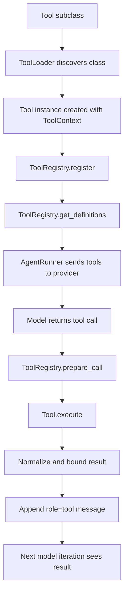

# Tool System in nanobot

This document explains how nanobot's tool system works internally.

It focuses on four questions:

- how tools are defined
- how tools are discovered and registered
- how tools are exposed to the model and executed
- how tool results, runtime context, and constraints feed back into the agent loop

At a high level, nanobot treats tools as a runtime subsystem rather than a bag of helper functions.

That subsystem has four core layers:

- `Tool` defines what one capability looks like.
- `ToolLoader` discovers and instantiates tools.
- `ToolRegistry` stores tools, exports schemas, and validates calls.
- `AgentRunner` places tool calling inside the model loop.

`AgentLoop` sits around those layers and injects the per-turn runtime context that makes shared tool instances safe to reuse.

## The Big Picture

The simplest mental model is this:

- `Tool` describes a capability.
- `ToolRegistry` is the live catalog of capabilities.
- `AgentRunner` shows that catalog to the model.
- the model chooses a tool by returning a tool call
- nanobot executes the tool and appends the result back into the conversation

That means the tool system is not separate from the agent loop.

It is one of the main mechanisms by which the loop moves from:

- perception
- decision
- action
- reflection

## One Tool Call, End to End

You can think of a single tool call as moving through this pipeline:

## The Main Pieces

The tool system is easiest to understand by walking from the lowest-level abstraction upward.

### `Tool`: one capability

Every tool inherits from `Tool` in `nanobot/agent/tools/base.py`.

A tool defines:

- `name`
- `description`
- `parameters`
- `execute(**kwargs)`

The base class also provides important default behavior:

- schema-driven parameter casting
- schema validation
- OpenAI-style function schema export through `to_schema()`
- concurrency metadata such as `read_only`, `exclusive`, and `concurrency_safe`

This means each tool is more than an async function. It is a typed, runtime-managed capability.

Source entry points:

- [`base.py`](../nanobot/agent/tools/base.py): `Tool`, `Schema`, `tool_parameters`

### `Schema`: parameter contracts

Tool parameters are defined with a small JSON Schema layer built around `Schema` and concrete types such as:

- `StringSchema`
- `IntegerSchema`
- `NumberSchema`
- `BooleanSchema`
- `ArraySchema`
- `ObjectSchema`

These classes do two jobs:

- they generate JSON Schema for the model provider
- they validate actual runtime arguments before tool execution

The `@tool_parameters(...)` decorator lets tool authors attach parameter schemas declaratively without rewriting the same `parameters` property for every tool.

Source entry points:

- [`schema.py`](../nanobot/agent/tools/schema.py): `StringSchema`, `IntegerSchema`, `ArraySchema`, `ObjectSchema`
- [`base.py`](../nanobot/agent/tools/base.py): `Schema.validate_json_schema_value()`, `tool_parameters`

### `ToolLoader`: discovery and instantiation

`ToolLoader` in `nanobot/agent/tools/loader.py` scans the `nanobot.agent.tools` package for concrete `Tool` subclasses.

It also supports plugin discovery through Python entry points:

- built-in tools come from package scanning
- external tools can be added through `entry_points(group="nanobot.tools")`

When a tool class is discovered, `ToolLoader.load()` decides whether to register it by checking:

- the requested scope such as `core` or `subagent`
- `enabled(ctx)`
- collision rules for built-ins and plugins

It then instantiates the tool through `tool_cls.create(ctx)` and registers the result in a `ToolRegistry`.

This is the boundary where static code turns into a live runtime capability.

Source entry points:

- [`loader.py`](../nanobot/agent/tools/loader.py): `ToolLoader`, `discover()`, `load()`

### `ToolContext`: dependency injection for tools

`ToolContext` carries the runtime services tools may need:

- config
- workspace
- message bus
- session manager
- subagent manager
- cron service
- runtime events
- sandbox and workspace metadata

This avoids hard-wiring tools to global state.

Tool creation is therefore explicit:

- `AgentLoop` builds the context
- `ToolLoader` passes it into each tool
- each tool decides how to use it in `create()`

Source entry points:

- [`context.py`](../nanobot/agent/tools/context.py): `ToolContext`, `RequestContext`, `ContextAware`
- [`loop.py`](../nanobot/agent/loop.py): `_register_default_tools()`

### `ToolRegistry`: the live catalog

`ToolRegistry` is the central runtime store for tools.

It is responsible for:

- registering and unregistering tools
- looking up a tool by name
- exporting model-facing tool definitions
- preparing a tool call by casting and validating parameters
- executing a tool by name

Its `get_definitions()` method converts all live tool instances into provider-facing function schemas and keeps a cached, stable ordering.

That ordering matters:

- built-in tools are sorted first
- MCP tools are grouped after them

This makes prompts more stable and cache-friendly.

Source entry points:

- [`registry.py`](../nanobot/agent/tools/registry.py): `ToolRegistry`, `register()`, `get_definitions()`, `prepare_call()`, `execute()`

## How Tools Reach the Model

The model does not learn about tools from prose in the prompt.

Instead, `AgentRunner._request_model()` passes structured tool definitions to the provider via:

- `spec.tools.get_definitions()`

So the chain is:

1. tools are registered in `ToolRegistry`
2. the registry exports JSON schemas
3. the provider receives them in the `tools=` request parameter
4. the model can return a structured tool call

In other words, nanobot uses the provider's native tool-calling interface, not a text-only imitation of one.

Source entry points:

- [`runner.py`](../nanobot/agent/runner.py): `_request_model()`
- [`registry.py`](../nanobot/agent/tools/registry.py): `get_definitions()`
- [`base.py`](../nanobot/providers/base.py): `ToolCallRequest`

## How a Tool Call Is Executed

The inner execution loop lives in `AgentRunner._run_core()`.

When the provider returns tool calls:

1. nanobot builds an assistant message containing those tool calls
2. it appends that assistant message to the in-memory conversation
3. it emits a checkpoint marking that the system is waiting on tools
4. it executes the requested tools
5. it turns each result into a `role="tool"` message
6. it appends those tool messages back into the conversation
7. the next model iteration sees the results and continues reasoning

This is nanobot's ReAct loop in practice:

1. think
2. choose a tool
3. act
4. observe the result
5. think again

Source entry points:

- [`runner.py`](../nanobot/agent/runner.py): `_run_core()`, `_execute_tools()`, `_run_tool()`
- [`base.py`](../nanobot/providers/base.py): `ToolCallRequest.to_openai_tool_call()`

## How Calls Are Validated Before Execution

Tool execution does not start with `tool.execute(...)`.

It starts with `ToolRegistry.prepare_call(...)`, which:

- resolves the tool by name
- applies safe schema-driven casts
- validates the arguments against the declared schema

If that step fails, nanobot returns a model-readable tool error instead of blindly invoking the tool.

This is an important design choice:

- tools declare their own parameter contracts
- the runtime enforces those contracts centrally

That keeps tool implementations simpler and keeps invalid tool calls inside the agent loop rather than turning them into uncontrolled exceptions.

Source entry points:

- [`registry.py`](../nanobot/agent/tools/registry.py): `prepare_call()`, `execute()`
- [`base.py`](../nanobot/agent/tools/base.py): `cast_params()`, `validate_params()`

## How Results Flow Back Into the Loop

Tool results are not treated as side logs.

They are converted into normal conversation messages with:

- `role="tool"`
- `tool_call_id`
- tool `name`
- normalized `content`

That matters because the next model call reads those messages directly.

So a tool call in nanobot is not:

- model calls Python
- Python returns to user

It is:

- model calls tool
- Python executes tool
- result becomes conversation state
- model reads the result and decides what to do next

That feedback path is what makes the tool system part of the reasoning loop.

Source entry points:

- [`runner.py`](../nanobot/agent/runner.py): `_run_core()`

## Result Normalization and Budgeting

Large tool outputs can destroy the context window if they are replayed forever.

So nanobot applies several layers of result control.

### Normalize tool results

`AgentRunner._normalize_tool_result()` ensures that tool output is:

- non-empty
- optionally persisted out of band
- truncated when it exceeds the configured result budget

### Repair broken tool histories

The runner also repairs message history around tool calls:

- orphan tool results can be dropped
- missing tool results can be backfilled with synthetic error placeholders

### Compact stale tool outputs

Older large tool results can be replaced with short summaries during replay so the active turn stays usable.

This means the tool system is designed not only for execution, but also for long-running conversational replay.

Source entry points:

- [`runner.py`](../nanobot/agent/runner.py): `_normalize_tool_result()`, `_drop_orphan_tool_results()`, `_backfill_missing_tool_results()`, `_microcompact()`, `_apply_tool_result_budget()`

## Runtime Context Injection

Most tools need more than just arguments.

They also need to know the current runtime environment:

- which channel this turn belongs to
- which chat is active
- which message triggered the turn
- which session key is active
- which workspace scope is allowed

nanobot injects that information in two layers.

### Layer 1: request context

`AgentLoop._set_tool_context()` builds a `RequestContext` and passes it to every `ContextAware` tool.

This is used by tools such as `MessageTool`, which need to understand routing and delivery targets.

### Layer 2: async contextvars

Inside `_run_agent_loop()`, nanobot binds per-turn context into `contextvars`, including:

- request context
- file state tracking
- workspace scope

This is why a shared tool instance can still behave like a session-aware tool.

The tool is shared at the object level, but it resolves the active request state dynamically from the current async task.

Source entry points:

- [`loop.py`](../nanobot/agent/loop.py): `_set_tool_context()`, `_run_agent_loop()`
- [`context.py`](../nanobot/agent/tools/context.py): `bind_request_context()`, `current_request_context()`

## Concurrency and Tool Safety

nanobot does not run every tool call in parallel.

Parallel execution is gated by tool metadata.

The main rules are:

- `concurrent_tools` must be enabled for the run
- a tool must be `concurrency_safe`
- by default, `concurrency_safe` means `read_only and not exclusive`

Then `AgentRunner._partition_tool_batches()` groups tool calls into safe parallel batches.

This prevents obviously dangerous combinations such as mixing write-heavy or exclusive tools into the same concurrent execution group.

So concurrency is opt-in and capability-aware, not a blanket runtime optimization.

Source entry points:

- [`base.py`](../nanobot/agent/tools/base.py): `read_only`, `exclusive`, `concurrency_safe`
- [`runner.py`](../nanobot/agent/runner.py): `_partition_tool_batches()`

## Constraints and Safety Boundaries

The tool system enforces several kinds of boundaries.

### Schema boundaries

Declared JSON Schema is used to cast and validate tool arguments before execution.

### Workspace boundaries

Filesystem-oriented tools resolve paths through workspace-aware helpers, which can restrict access to the project root or sandbox-approved directories.

### Runtime boundaries

Per-turn context is bound through `RequestContext`, file-state bindings, and workspace scope bindings.

### Execution boundaries

The runner can classify and throttle repeated violations such as:

- repeated external lookups
- workspace access violations

### Provider compatibility boundaries

MCP-derived tools are normalized so their names and schemas remain acceptable to model providers.

Together, these constraints make the tool system operationally safer than a naive "LLM picks a Python function" design.

Source entry points:

- [`base.py`](../nanobot/agent/tools/base.py): schema validation and casting helpers
- [`filesystem.py`](../nanobot/agent/tools/filesystem.py): `_FsTool`, `_resolve()`
- [`runner.py`](../nanobot/agent/runner.py): `_run_tool()`

## Where MCP Fits

MCP tools are not a separate execution model.

From the model's perspective, they become normal tools in the same registry.

The MCP layer wraps remote capabilities in `Tool`-compatible objects, then registers them alongside built-in tools.

That gives nanobot a unified model:

- built-in tool
- plugin tool
- MCP-backed tool

All three eventually look the same to:

- `ToolRegistry`
- `AgentRunner`
- the model provider

That unification is one of the strongest parts of the design.

Source entry points:

- [`mcp.py`](../nanobot/agent/tools/mcp.py): `_MCPWrapperBase`
- [`registry.py`](../nanobot/agent/tools/registry.py): shared registration surface

## A Concrete Example: `MessageTool`

`MessageTool` is a good example because it shows that a tool is not just a function wrapper.

It uses:

- a declared schema for `content`, `channel`, `chat_id`, `media`, and `buttons`
- request-context injection to inherit current routing information
- turn-local state such as whether the tool already sent a message in the current turn
- workspace-aware media resolution for attachments

That illustrates a broader point:

tools in nanobot can be stateful at the turn level without becoming global mutable state.

Source entry points:

- [`message.py`](../nanobot/agent/tools/message.py): `MessageTool`, `set_context()`, `start_turn()`, `execute()`

## How to Read the System

If you want to explore the code efficiently, this order works well:

1. [`nanobot/agent/tools/base.py`](../nanobot/agent/tools/base.py)
2. [`nanobot/agent/tools/schema.py`](../nanobot/agent/tools/schema.py)
3. [`nanobot/agent/tools/registry.py`](../nanobot/agent/tools/registry.py)
4. [`nanobot/agent/tools/loader.py`](../nanobot/agent/tools/loader.py)
5. [`nanobot/agent/loop.py`](../nanobot/agent/loop.py)
6. [`nanobot/agent/runner.py`](../nanobot/agent/runner.py)
7. [`nanobot/agent/tools/message.py`](../nanobot/agent/tools/message.py)
8. [`nanobot/agent/tools/filesystem.py`](../nanobot/agent/tools/filesystem.py)
9. [`nanobot/agent/tools/mcp.py`](../nanobot/agent/tools/mcp.py)

Read them with this question in mind:

> How does a declared capability become a model-visible action, and where is that action constrained?

That question usually exposes the whole design faster than reading individual tools in isolation.

## Key Source Entry Points

If you only want the main entry points, start here:

- `nanobot/agent/tools/base.py`
- [`base.py`](../nanobot/agent/tools/base.py): `Tool`, `Schema`, `tool_parameters`
- [`schema.py`](../nanobot/agent/tools/schema.py): `StringSchema`, `ArraySchema`, `ObjectSchema`
- [`registry.py`](../nanobot/agent/tools/registry.py): `ToolRegistry`, `get_definitions()`, `prepare_call()`, `execute()`
- [`loader.py`](../nanobot/agent/tools/loader.py): `ToolLoader`, `discover()`, `load()`
- [`loop.py`](../nanobot/agent/loop.py): `_register_default_tools()`, `_set_tool_context()`, `_run_agent_loop()`
- [`runner.py`](../nanobot/agent/runner.py): `_request_model()`, `_run_core()`, `_execute_tools()`, `_run_tool()`, `_normalize_tool_result()`, `_partition_tool_batches()`
- [`message.py`](../nanobot/agent/tools/message.py): `MessageTool`
- [`filesystem.py`](../nanobot/agent/tools/filesystem.py): `_FsTool`
- [`mcp.py`](../nanobot/agent/tools/mcp.py): `_MCPWrapperBase`

## How to Extend the Tool System

If you want to add a new tool, the usual path is:

1. create a new `Tool` subclass
2. declare its parameter schema
3. implement `execute()`
4. decide whether it is read-only or exclusive
5. implement `create(ctx)` if it needs runtime services
6. make sure it is discoverable by `ToolLoader`

In practice, there are three extension styles:

- add a new built-in tool under `nanobot/agent/tools`
- add an external plugin via `entry_points(group="nanobot.tools")`
- expose a remote capability through the MCP integration layer

The key architectural rule is simple:

- declare the capability cleanly
- let the runtime handle registration, validation, and execution flow

## A Compact Mental Model

If you want one short summary, use this:

- `Tool` defines the contract
- `ToolLoader` activates the contract
- `ToolRegistry` governs the contract
- `AgentRunner` turns the contract into model actions
- `AgentLoop` injects the environment those actions run inside

Together they make tool use in nanobot:

- structured rather than ad hoc
- replayable rather than ephemeral
- constrained rather than free-form
- part of reasoning rather than outside it
